# Business Analysis

## Introduction
This project aims to analyze and segment businesses based on their purchasing behavior, as well as evaluate product performance. The goal is to classify businesses into distinct value groups, forecast future sales, detect anomalies, and provide actionable insights. Additionally, product analysis will identify which products perform well in the market, understand seasonal trends, and assess the relationship between quantity sold and total revenue generated. Ultimately, these insights will enhance customer engagement, retention, and operational efficiency.

## Background Problem
Understanding customer purchasing behavior is essential for optimizing business strategy and operations. The project addresses the following key questions:

1. How can businesses be segmented based on their purchasing behavior?
2. What are the expected total sales for the next three months for different business segments?
3. Are there any anomalies in purchasing trends, and what factors might contribute to these anomalies?
4. How does the quantity sold relate to the total revenue generated by different products?
5. What strategies can businesses implement to optimize their marketing and operational efforts based on the analysis?
6. How do various products perform in the market, and what insights can be drawn from their sales data?
7. What are the seasonal trends affecting product performance and business sales?

The dataset used is [dataset](Data/Cleaned_data.csv)

## Tools Used
- **Python** (Pandas, NumPy, Scikit-learn, Statsmodels, Matplotlib, Seaborn)
- **Time-Series Forecasting** (ARIMA, Moving Averages)
- **Anomaly Detection** (Isolation Forest, Z-Score Analysis)
- **Correlation Analysis**
- **Dashboarding Tools** (Power BI, Plotly)

## Methodology
### 1. Segmentation Analysis
- Businesses were categorized into three groups based on:
  - **Total Quantity Purchased**
  - **Total Value Contributed**
  - **Frequency of Transactions**
- Clustering techniques (K-Means) were applied to classify businesses into **High Value, Medium Value, and Low Value** groups.
- Recommendations were provided for engaging each segment.

### 2. Sales Forecasting
- Time-series forecasting models such as **ARIMA** were used to predict sales for the next three months.
- Trend analysis was performed to identify seasonal fluctuations.

### 3. Anomaly Detection
- Anomalies (spikes or drops in sales) were detected using:
  - **Z-Score Analysis** to identify outliers
  - **Isolation Forest Algorithm** for unsupervised anomaly detection
- Possible reasons for anomalies were investigated based on historical data.

### 4. Correlation Analysis
- The relationship between **Total Quantity Purchased** and **Total Value Contributed** was examined.
- Factors influencing sales performance were identified.

### **Analysis & Insights:**

Detailed analysis and tables[python file](<python _files/case_eda.ipynb>)
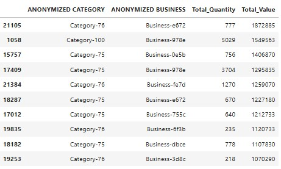
#### **1. Data Overview **
- The dataset includes anonymized categories, businesses, and their corresponding `Total_Quantity` and `Total_Value`.
- `Category-76`, `Category-100`, and `Category-75` dominate the dataset.
- `Business-978e` (under `Category-100`) has the highest `Total_Quantity` (5029) and a high `Total_Value` (1,549,563), while `Business-e672` has a quantity of (777) and a `Total_Value`  of (KES 1,872,885) products from category `Category-76` indicating a strong sales contribution
- `Business-e672` appears twice under different categories with high `Total_Value`, implying it might be a key business.
- There is a mix of high-volume and low-volume businesses.

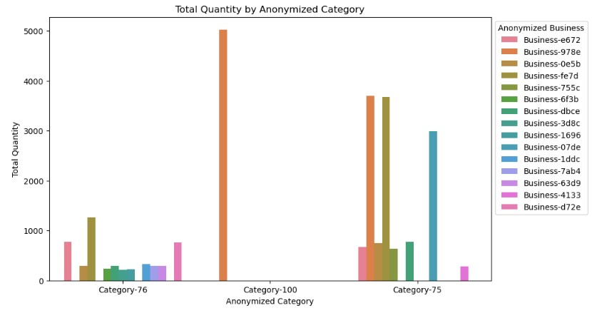
#### **2. Bar chart of best perfoming categories among the businesses**
- **Key Observations:**
  - `Category-100` has one dominant business (`Business-978e`) contributing significantly to its total quantity.
  - `Category-75` and `Category-76` have multiple businesses contributing more evenly.
  - `Category-76` has a relatively lower total quantity but a diverse spread across multiple businesses since products in this category have a higher unit price.
  - There are some small contributors with significantly lower sales quantities.

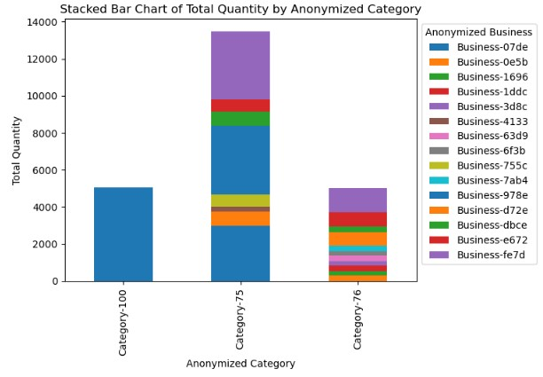
#### **3. Stacked Bar Chart for top categories**
- **Key Observations:**
  - `Category-75` has the highest total quantity, with many businesses contributing.
  - `Category-100` is driven by a single dominant business.
  - `Category-76` has moderate sales distributed across multiple businesses.
  - Some businesses have a minor presence, indicating potential inefficiencies or niche operations.
Based on the provided data, we can analyze the **high variability categories** and the **top category** to generate insights and recommendations.

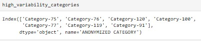
4. **High Variability Categories**:
   - The listed categories exhibit significant fluctuations in sales performance. Categories such as **Category-75**, **Category-76**, **Category-120**, **Category-100**, **Category-77**, **Category-119**, and **Category-91** may experience irregular sales patterns, indicating potential issues or opportunities.
   - High variability can stem from factors like seasonal demand, marketing effectiveness, competition, or changes in consumer preferences.

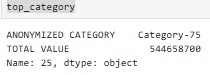
5. **Top Category**:
   - **Category-75** is identified as the top category with a total value of **KES 544,658,700**. This indicates strong sales performance and suggests that it is a key driver of revenue.
To analyze the provided data of anonymized products, we will look at both tables to derive insights and make recommendations.

### Products Analysis
Detailed analysis and tables[python file](<python _files/Business and product exploration.ipynb>)
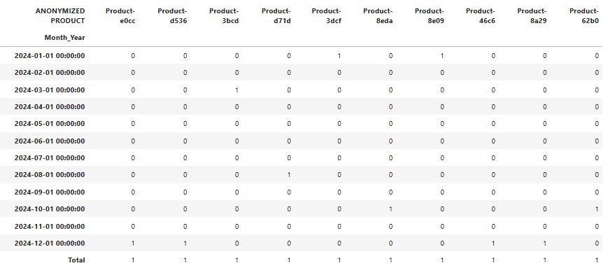
1. **10 Low Performing Products throught the Year**:
   - Consists of binary values (0 or 1) indicating whether a product was sold in a given month. 
   - Most products appear to have limited sales activity, as many entries are zero, indicating no sales for those months.

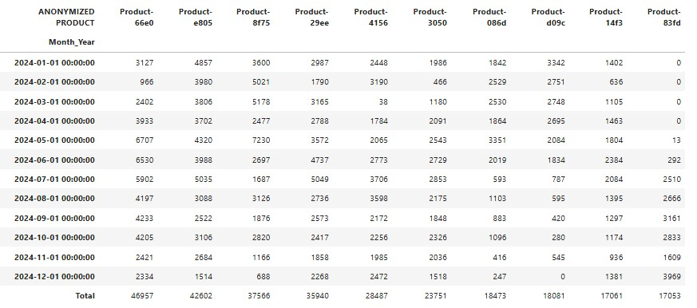
2. **1O High Performing Products throught the Year**:
   - Contains the actual sales figures (quantities) for multiple products over the same time period.
   - The data shows varying sales numbers for different products across the months, with certain products consistently performing better than others.

### key insights from the product analysis
1. **Sales Activity**:
   - The first table suggests that many products have sporadic or no sales, indicating potential issues with demand, visibility, or marketing effectiveness.
   - The second table indicates that some products (e.g., Product-66e0, Product-e805) have significant sales volumes, while others (e.g., Product-1413, Product-831d) may not be performing as well.

2. **Seasonal Trends**:
   - Analyzing the monthly sales figures in the second table can reveal seasonal trends. For instance, if certain products show peaks during specific months, it may suggest seasonality in demand.

3. **Product Performance**:
   - Some products consistently show higher sales, while others have low or fluctuating performance. This disparity suggests that factors such as product features, pricing, or marketing strategies may be influencing performance.
Based on the provided information and visualizations regarding businesses with declining purchase frequency, we can analyze the data and offer insights and recommendations.

### Businesses Analysis

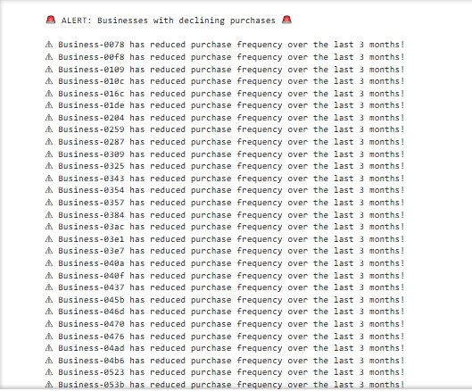
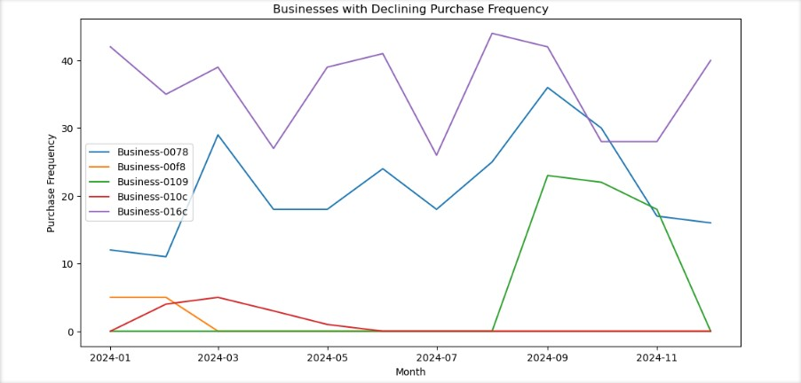
Details and tables[Declining bussines](<python _files/Business and product exploration.ipynb>)
1. **Declining Purchase Frequency Among businesses**:
   - The line chart indicates several businesses (e.g., Business-0078, Business-0018, etc.) with noticeable declines in purchase frequency over the months.
   - Some businesses show erratic patterns in their purchase frequency, suggesting inconsistent buying behavior or possible dissatisfaction.
   - The chart shows businesses that have declined their purchases in the past three months raising an attention

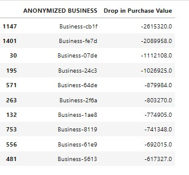
2. **Businesses with Significant Drops**:
   - The tabular data highlights businesses experiencing substantial drops in purchase value, including:
     - Business-cb1f: -$2,613,520
     - Business-07de: -$2,089,958
     - Business-24c3: -$1,126,108
   - This indicates that these businesses are not only purchasing less frequently but also significantly reducing their spend.
   - Through this we can be able to deduce the drop in purchase values in various businesses and follow up on them

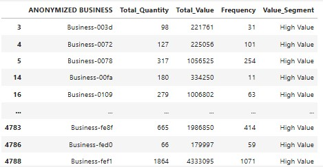

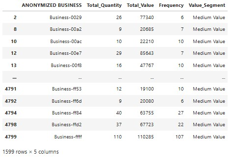
3. **Value Segmentation**:
   - The businesses are categorized by value segments (High, Medium, Low). Some high-value businesses are showing declining purchase frequency, which could have a significant impact on overall revenue.

### Key Business Insights
1. **Risk of Customer Loss**:
   - The declining purchase frequency, especially among high-value customers, indicates a risk of losing these accounts if proactive measures are not taken.

2. **Potential Reasons for Decline**:
   - Possible reasons for the declining purchase frequency may include:
     - **Dissatisfaction with Products/Services**: If businesses feel that their needs are not being met, they may reduce their purchases.
     - **Competitive Offers**: Competitors may offer better pricing, products, or services, prompting customers to switch.
     - **Budget Cuts**: Economic factors may lead businesses to cut back on spending.

3. **Segmentation Insights**:
   - High-value customers are particularly concerning because their departure would have a disproportionate impact on revenue. 
   - For the medium businesses we can also do a deep research , to improve on their purchases .

### Data Overview
Detailed analysis and tables[pythonfile](<Data/Case Study Data.csv>)
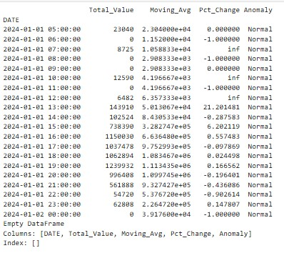
1. **Anomalies and Moving Average**:
   - The table shows **Total Value**, **Moving Average**, **Percentage Change**, and **Anomaly Status**.
   - The presence of anomalies indicates unusual spikes or drops in sales, while the moving average helps smooth out fluctuations for better trend analysis.
   - The table indicates that the anomalies are normal, We can use other creterias and features to look more into this area

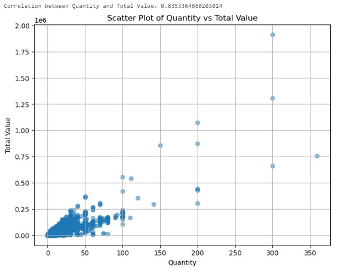
2. **Scatter Plot**:
   - The scatter plot illustrates the relationship between **Quantity** and **Total Value**, with a correlation coefficient of approximately **0.83**, indicating a strong positive correlation.
   - Higher quantities generally lead to higher total values, suggesting that increased sales volume is beneficial for revenue.

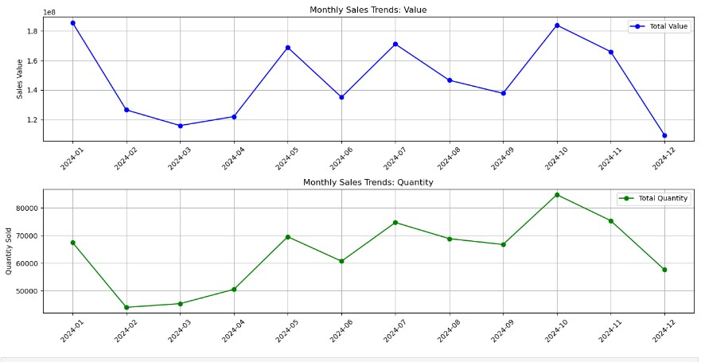
3. **Monthly Sales Trends**:
   - The line graphs illustrate trends in **Total Value** and **Quantity Sold** over the months.
   - The sales value and quantity trends show fluctuations, indicating potential seasonality or the impact of specific events or promotions.

###  key Insights from Data overview
1. **Anomalies**:
   - Significant anomalies in Total Value may correspond to specific events (e.g., promotions, new product launches) or external factors (e.g., market changes).
   - The presence of `inf` values in percentage change indicates drastic fluctuations, which should be investigated further.
   - - **Root Cause Analysis**: Conduct a detailed analysis of the periods marked as anomalies to understand the underlying causes. This could involve looking into marketing activities, customer feedback, or external market conditions.
   - **Adjust Strategies**: If anomalies are tied to specific events, refine marketing strategies to capitalize on these opportunities in the future.

2. **Strong Correlation**:
   - The strong correlation between Quantity and Total Value suggests that increasing sales volume is crucial for improving revenue. This relationship can guide inventory and marketing strategies.
   -  Given the strong correlation between Quantity and Total Value, ensure that inventory levels are managed to meet demand, especially during peak periods.
   - Implement a data-driven inventory management system that uses historical sales data to forecast future demand more accurately.

3. **Sales Trends**:
   - Monthly trends indicate periods of growth and decline, suggesting there may be seasonal influences or the impact of marketing efforts. Understanding these patterns can help in planning future campaigns.

### Location Analysis
Based on the analysis of sales data by location and business, here are some insights and recommendations:
Top 20 locations with the highest business count
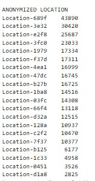
 **Underperforming and Overperforming Locations**:
  Locations such as **Location-689f** has the highest number of businesses at **43,890** while **Location-d18a** with total number  of business at **2,825** indicate potential issues, such as lack of market penetration or poor product offerings.

### Business with higher sales in varied locations

1. **Total Sales Distribution**:
   - The bar chart demonstrates a highly skewed distribution of total sales across locations. The top locations, such as **Location-689f** and **Location-3e32**, generate significantly higher sales compared to others, indicating a concentration of revenue in a few areas.

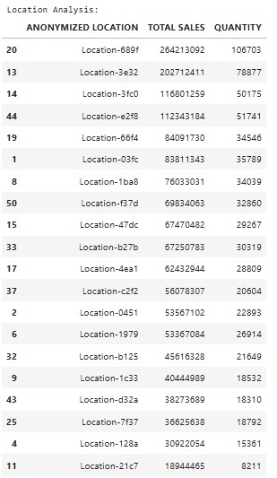
2. **Top Locations with higher sales**:
   - **Location-689f** stands out with total sales of **KSh 264,213,790**, which is remarkably higher than the second location, **Location-3e32**, at **KSh 202,121,411**. This suggests that Location-689f is a key revenue driver.
   - **Focus on High-Performing Locations**: Invest resources in **Location-689f** and **Location-3e32** to maintain and grow market share. Strategies could include enhanced marketing efforts, customer loyalty programs, and expanding product offerings to capitalize on existing sales momentum.
   - **Sales Quantity**:The **Quantity** column associated with the locations indicates that higher sales do not always correlate with higher quantities sold. For instance, **Location-689f** has a high total sales figure but may not have the highest quantity sold, which might indicate a premium pricing strategy.

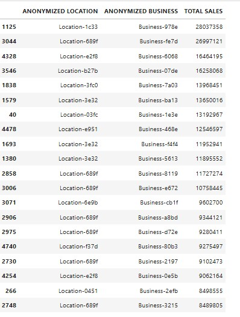
1. **Business Performance**:
   - An examination of the businesses shows that **Business-978e** in **Location-689f** has the highest sales of **KSh 2,807,358**, suggesting that certain businesses are performing significantly better within high-revenue locations.
   - The bar chart for **Total Sales by Business** reveals that **Business-978e** has the highest sales at **KSh 2,807,358**, significantly outperforming others. This business is a key contributor to revenue in the selected locations.
   - Other notable businesses include **Business-676d** and **Business-606e**, with sales figures of **KSh 2,699,721** and **KSh 1,646,419**, respectively. These businesses also appear to be strong performers.
   - **Leverage High-Performing Businesses**: Focus on supporting and promoting **Business-978e** and other high-performing businesses through targeted marketing campaigns and resource allocation. These businesses can serve as models for best practices in sales strategies
   - **Strategic Pricing Models**: Evaluate pricing strategies across businesses and products. For example, consider whether a premium pricing model can be applied to more products based on the success observed with **Business-978e**.

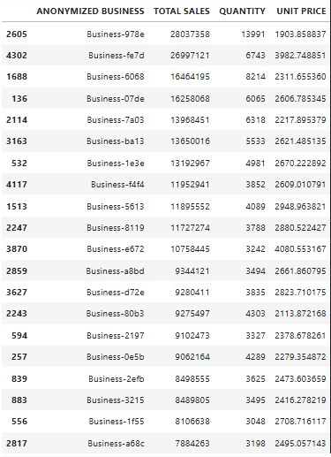
2. **Sales Quantity vs. Unit Price**:
   - The data for businesses indicates variations in sales quantities and unit prices. For instance, **Business-606e** has a relatively low unit price but still generates substantial sales, suggesting high sales volume. This could indicate a successful low-cost strategy or a popular product line.
   - Conversely, **Business-978e** has a higher unit price, which correlates with its high total sales, indicating effective premium positioning.

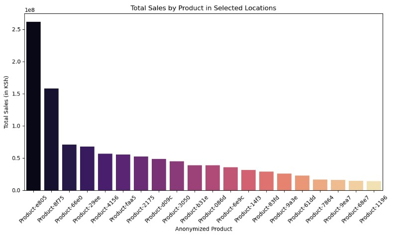
1. **Total Sales by Product**:
   - The **Total Sales by Product** chart shows a strong concentration of sales in specific products. **Product-6069** leads with total sales of **KSh 2,564,210**, indicating it is a best-seller.
   - Other high-performing products include **Product-875** and **Product-6809**, suggesting that certain products drive much of the revenue.
   **Product Performance and Strategy**:
   - The disparity in product sales suggests that evaluating product assortment and promotional strategies could yield benefits. High sales in a few products may indicate opportunities to expand product lines or introduce complementary items.
   - Analyze the product mix, especially the top sellers like **Product-6069**. Consider expanding complementary products or variations that can tap into the existing customer base in the same location.
   - **Cross-Selling Strategies**: Utilize insights from high-performing products to create cross-selling opportunities among businesses. For instance, if **Product-6069** is a best-seller, consider promotions that bundle it with less popular items to boost overall.
   -  **Product and Pricing Strategy**:Consider evaluating the product mix and pricing strategies in high-performing locations to identify best-sellers and optimize inventory. The high sales at locations with fewer quantities sold suggest that premium pricing or exclusive products could be effective. 

### key Recommendations
1. **Targeted Marketing Campaigns**:
   - Develop targeted marketing campaigns based on historical sales trends, particularly focusing on increasing quantity sold during low-sales months.
   - Use promotions, discounts, or loyalty programs to encourage higher purchase volumes.

2. **Focus on Customer Segmentation**:
   - Analyze customer segments to tailor marketing efforts effectively. For example, identify high-value customers and create personalized offers to increase their purchasing frequency.
   - Implement a feedback mechanism to gather insights from customers about their purchasing behavior and preferences.

3. **Continuous Monitoring**:
   - Establish a regular reporting system to monitor sales performance, anomalies, and trends. Dashboards can be beneficial for visualizing key metrics and making data-driven decisions.
   - Use predictive analytics to anticipate sales trends based on historical data, allowing for proactive adjustments to marketing and inventory strategies.

4. **Customer Engagement Strategies**:
   - **Conduct Surveys**: Reach out to these businesses to understand their concerns and gather feedback. This can help identify specific issues driving the decline.
   - **Personalized Communication**: Implement targeted communication strategies to re-engage these customers, including personalized emails offering discounts or tailored solutions.

5. **Retention Programs**:
   - **Loyalty Programs**: Introduce or enhance loyalty programs that reward frequent purchases. This can incentivize businesses to maintain or increase their purchase frequency.
   - **Account Management**: Assign account managers to high-value customers to foster relationships and address any concerns promptly.

6. **Competitive Analysis**:
   - **Benchmarking**: Analyze competitor offerings and pricing strategies. Ensure your products/services are competitively positioned to retain customers.
   - **Promotions**: Consider limited-time promotions or bundles for high-value customers to encourage them to return to previous purchase levels.

7. **Monitor and Analyze**:
   - **Regular Monitoring**: Establish a system for regularly monitoring purchase frequency and value across all customer segments. Early detection of declining trends can prompt timely interventions.
   - **Customer Segmentation**: Further analyze customer segments to tailor marketing and retention strategies effectively, ensuring that resources are focused on those most at risk.

8. **Focus on High-Performing Products**:
   - **Increase Marketing**: Allocate more marketing resources to high-performing products (e.g., Product-66e0 and Product-e805) to further boost visibility and sales.
   - **Cross-Promotion**: Implement cross-promotion strategies with these products to encourage customers to purchase lower-performing items.

9. **Investigate Low-Performing Products**:
   - **Market Research**: Conduct market research to understand why certain products are not selling. This could involve customer surveys or analyzing competitor offerings.
   - **Product Improvements**: If specific products have low sales, consider enhancing their features, adjusting pricing, or improving packaging.

10. **Inventory Management**:
   - **Stock Optimization**: Use the sales data to optimize inventory levels. Ensure that high-demand products are well-stocked while reducing inventory for low-performing items.
   - **Review Sales Patterns**: Implement predictive analytics to forecast demand for products based on historical sales trends, which can help in better inventory planning.

11. **Seasonal Campaigns**:
   - **Targeted Promotions**: If seasonal trends are detected, create targeted marketing campaigns around those periods to maximize sales.
   - **Bundling Offers**: Consider bundling products that are typically purchased together or those that complement each other, especially during peak sales months.

12. **Focus on High Variability Categories**:
   - **Investigate Causes of Variability**: Conduct a deeper analysis to understand why these categories fluctuate. Look at seasonal trends, promotions, or market competition.
   - **Stabilize Sales Performance**: Consider targeted marketing campaigns or promotions aimed at stabilizing sales in these categories. For example, if a category sees a dip during certain months, a promotional strategy could mitigate that.

13. **Leverage Top Category (Category-75)**:
   - **Increase Marketing Efforts**: Since Category-75 is a top performer, increase marketing investments to further boost visibility and sales. Use targeted advertisements, special promotions, or bundling offers with other products to maximize sales.
   - **Explore Product Line Expansion**: Given its success, consider expanding the product line within Category-75. Introducing variations or complementary products can enhance customer engagement and sales.
   - **Customer Feedback**: Collect feedback from customers regarding Category-75 to identify areas for improvement or new features they may want. This can help maintain customer loyalty and enhance product offerings.

14. **Data-Driven Decisions**:
   - Use analytics tools to continuously monitor sales performance. Set up dashboards to track performance metrics for both high variability categories and top performers.
   - Implement a predictive analytics model to forecast demand better and adjust inventory levels accordingly, particularly for high variability categories.

15. **Optimize Business Strategies:**
   - `Business-978e` is a significant driver of sales in `Category-100`; this business should be prioritized for further investment, inventory stocking, or exclusive deals.
   - `Category-75` is diverse in sales distribution. Identifying top-performing businesses here and optimizing underperforming ones is crucial.
   - `Category-76` has a more even distribution but lower total sales. Investigating whether marketing, pricing, or product availability improvements can boost numbers is necessary.

16. **Identifying Growth Opportunities:**
   - Investigate why `Category-100` is dominated by a single business. Encouraging competition or introducing new businesses could diversify risk.
   - The businesses with lower sales in `Category-76` might benefit from targeted promotions or bundling strategies.

17. **Revenue vs. Quantity Analysis:**
   - While `Business-978e` has the highest quantity, checking its `Total_Value` efficiency (price per unit) versus other businesses can reveal potential profitability issues.
   - High-value but low-quantity businesses may indicate premium products that need different marketing strategies.

18. **Consider Business-Specific Interventions:**
   - Businesses contributing little to total quantity should be analyzed. They may need better market positioning, product adjustments, or operational changes.

19. **Further Analysis:**
   - Looking at trends over time can help forecast demand and optimize inventory.
   - Comparing `Total_Quantity` with `Total_Value` per business can refine pricing strategies.

20. **Product Strategy**
- Recommended prioritizing a specific product category for marketing campaigns based on historical sales performance.

21. **Customer Retention**
- Identified businesses with declining purchase frequency.
- Suggested personalized promotions and targeted outreach strategies to re-engage lapsed customers.

23. **Operational Efficiency**
- Suggested improvements to inventory management and supply chain processes.
- Recommended stock level adjustments based on seasonal trends and purchasing patterns.
24. **Product and Pricing Strategy**:
   - Consider evaluating the product mix and pricing strategies in high-performing locations to identify best-sellers and optimize inventory. The high sales at locations with fewer quantities sold suggest that premium pricing or exclusive products could be effective.

25. **Cross-Promotion**:
   - Leverage successful businesses in high-performing locations to cross-promote products in underperforming areas. This could include creating bundles or special promotions that encourage customers to explore offerings they might not have considered.
  
## Predictive Analysis: External Factors Influencing Sales & Methodology for Incorporation
### **External Factors That Could Influence Sales:**

#### Economic Conditions:
- Inflation rates, interest rates, and GDP growth impact consumer spending.
- Unemployment rates affect business purchasing power.

#### Competitor Actions:
- Price changes, promotions, or product launches from competitors can shift market demand.
- Entry of new competitors into the market.

#### Seasonality & Market Trends:
- Consumer behavior changes during holidays, festivals, or special events.
- Demand fluctuates for certain products based on weather conditions.

#### Supply Chain Disruptions:
- Global supply chain issues (e.g., shipping delays, raw material shortages) impact inventory.
- Political instability, natural disasters, or trade restrictions.

#### Marketing & Advertising Efforts:
- Effectiveness of marketing campaigns, online presence, and brand perception.

#### Regulatory Changes:
- Changes in taxation, import/export policies, or government regulations.

### **Methodology to Incorporate External Factors into Sales Predictions:**

#### Data Collection:
- Integrate external datasets such as:
  - Economic indicators (from sources like World Bank, IMF).
  - Competitor pricing and sales data (scraped from online marketplaces).
  - Google Trends data to track consumer interest.
  - Weather APIs to include seasonal/weather effects.

#### Feature Engineering:
- Create new variables (e.g., inflation-adjusted pricing, competitor discounts).
- Incorporate time-series lag variables to assess the delayed effect of economic changes.

#### Machine Learning Forecasting:
- Use Multi-Variable Time-Series Models such as:
  - **Prophet:** Incorporates holiday effects and external regressors (e.g., economic indicators).
  - **XGBoost/Random Forest Regressors:** Identify non-linear relationships in sales data.
  - **LSTM (Long Short-Term Memory) Neural Networks:** Handle sequential dependencies in sales patterns.

#### Model Evaluation:
- Train models on historical sales and external factors.
- Use performance metrics like **RMSE (Root Mean Square Error)** and **MAPE (Mean Absolute Percentage Error)** to evaluate predictions.

#### Scenario-Based Forecasting:
- Run simulations with different economic conditions (e.g., high inflation vs. low inflation scenarios).
- Adjust pricing and marketing strategies based on predicted trends.

## Dashboard and Reporting
A dashboard was created to visualize key insights, including:
- **Total Quantity and Value by Category**
- **Top-Performing Products and Businesses**
- **Time-Series Sales Trends**
- **Customer Segmentation Summary**

**[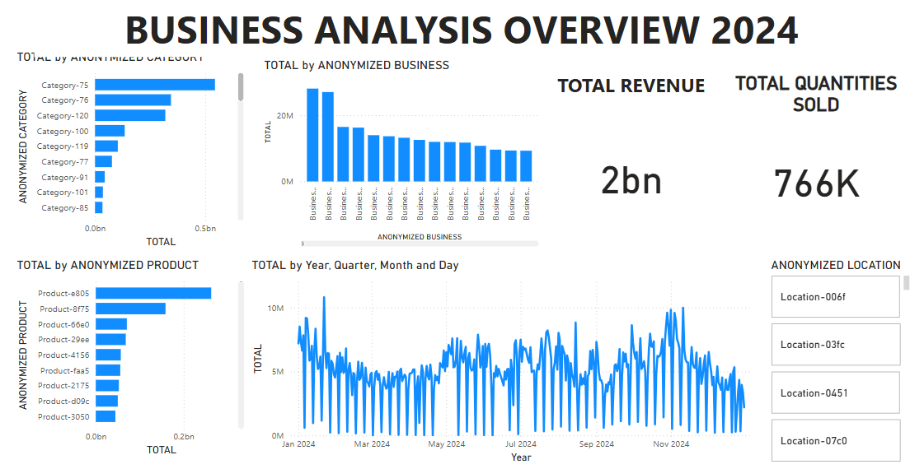]**
Link to my powerBI Dashboard[Dashboard](<python _files/BUSINESS ANALYSIS.pbit>)

## Conclusion
This project provides a comprehensive analysis of business purchasing behavior, segmentation, forecasting, and anomaly detection. The insights derived can help businesses optimize customer engagement, marketing strategies, and operational efficiency.

### Future Work
- Incorporate real-time sales data for dynamic forecasting.
- Implement machine learning-based recommendation systems for personalized marketing.
